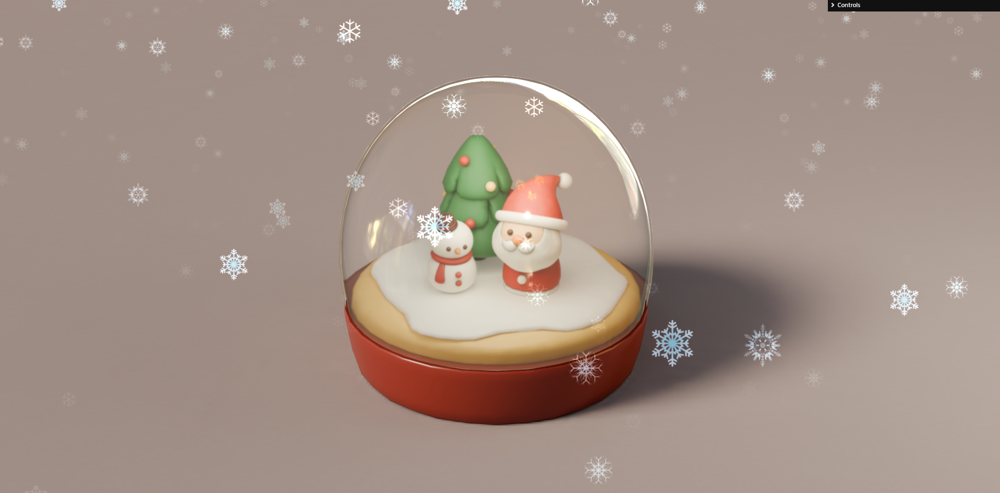
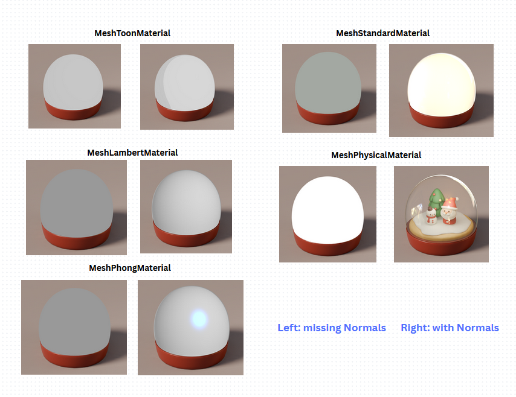

# Snowdome

## Demo
https://snowdome-xi.vercel.app/ 
 
 

### My Learnimg Memo

 When exporting in Blender, check normals for materials that requires lights.
 In Blender: select the dome mesh → Edit Mode → Select All → Mesh → Normals → Recalculate Outside (or press Shift+N), then in export setting, check Mesh > Normals
 
 Or use this code after loading the model: dome.geometry.computeVertexNormals() 
 (but fixing in Blender is preferred since it bakes the normals into the file.)
